<div align="center">



**[bavenstrand.se/tracktour](https://bavenstrand.se/tracktour/)**

[](https://github.com/ErikBavenstrand/tracktour/actions/workflows/deploy.yml)
[](LICENSE)

</div>

Rank every track on an album by comparing two at a time, with a 30-second
preview on each side. No account and no server — a ranking lives in your browser
and in whatever links you hand out.

```bash
npm install && npm run dev
```

## Why a sort, not Elo

Your favourite track does not get better while you answer, so the order is a
fixed unknown — a sorting problem, and sorting has a floor of log2(n!)
comparisons. Rating systems keep re-asking what transitivity already settled:
in simulation Glicko needed ~45 duels for a 13-track album and still left pairs
inverted, where binary insertion finishes in 32 against a floor of 33. The
literature agrees — sort-based ranking [beats Elo while cutting comparisons by
up to 70%](https://link.springer.com/chapter/10.1007/978-3-031-70378-2_15), and
[sorting stays informative even when answers are noisy](https://arxiv.org/abs/1502.05556).

So the progress bar is exact rather than a heuristic, and reaches 100% because
the work is finite.

**Mistakes get a second pass.** A sort takes every answer as true, and one slip
in a wide binary search can carry a track several places. Re-asking each
neighbouring pair costs n−1 questions and is exactly where a displaced track
surfaces: on a 20-track album that took total displacement from 11.8 to 0.8.
Offered once the order exists, never forced.

**Skits are proposed for removal, not filtered.** No catalogue marks them —
Deezer types every entry as `track`, and popularity rank is no help, with The
College Dropout's skits scoring 320–404k against real tracks at 325–576k. So it
is inferred from the title and from length relative to the album's own median.
An absolute cut cannot work: Napalm Death's *Scum* has a median of 66 seconds.
The guess still misfires — "Her Majesty" is 25 seconds and entirely a song —
so suggestions start excluded and any track goes back with one tap.

**Tiers come from proportion.** A sort learns order and nothing about the
distance between neighbours, so bands are shares of the list rather than natural
breaks — a real cost of asking the minimum number of questions.

## Sharing

A ranking packs into a permutation plus tier boundaries: 26 characters for a
13-track album, 39 once it carries everything needed to share it, 47 for a
20-track one. The recipient's browser refetches the album, so only positions
travel. The code lives in the URL *fragment*, which browsers never transmit —
on GitHub Pages a shared ranking is not merely unstored, it is unobservable by
the host. Paste several into `#/c/<code>~<code>` to compare them; agreement is
the mean Kendall tau over every pair of people, measured on the tracks they all
ranked, so a shorter list does not read as systematically higher.

**A code says who made it and when.** A name cannot tell two friends called Erik
apart, nor a current ranking from a stale copy doing the rounds in a group chat.
So a code also carries a random per-browser author id and the day it was saved —
four characters between them. The same person re-ranking replaces their own
entry, a namesake gets one of their own, an import never overwrites what you
made, and a comparison can tell you it is six days out of date and offer the
newer one. Older codes still read; they just cannot answer those questions.

## Data source

One catalogue supplies search, artwork, tracklists and previews. Swap it in
[`src/config.ts`](src/config.ts); add one by implementing `Provider` in
[`src/lib/providers/`](src/lib/providers/).

| | Coverage¹ | Previews | Transport |
|---|---|---|---|
| **Deezer** (default) | 19/20 | expire after ~15 min | JSONP — no CORS headers |
| Apple / iTunes | 14/20 | never expire | plain `fetch` |

¹ Canonical albums found by artist+title search, across 20 records. Apple's gaps
are structural: its endpoint indexes the iTunes Store download catalogue, not
Apple Music, so streaming-era releases return tribute albums instead.

**Spotify** cannot be a source — `api.spotify.com` is 401 without a token, and
the only token obtainable without a user needs a secret that cannot ship in a
static bundle. Paste a Spotify album link and it resolves via the CORS-open
oEmbed endpoint, then cross-matches to the active catalogue.

## Keyboard

`←` `→` pick · `1` `2` hear each side · `space` too close to call · `Z` undo ·
`enter` finish. Answering clears focus, so space keeps meaning "too close" after
a click; it still activates a control you deliberately tab to.

## Deploying

Push to `main`. The workflow typechecks, tests, builds and publishes to Pages.
`VITE_BASE` is set to `/<repo>/` because this is a project page served from a
subpath; a domain of its own would drop that and add a `public/CNAME`.

## Licence

[MIT](LICENSE) for this source. Album metadata, artwork and previews come from
Deezer and remain subject to [their terms](https://developers.deezer.com/termsofuse),
which require any application using the API to show a
[clearly visible Deezer logo](https://developers.deezer.com/guidelines/logo).
